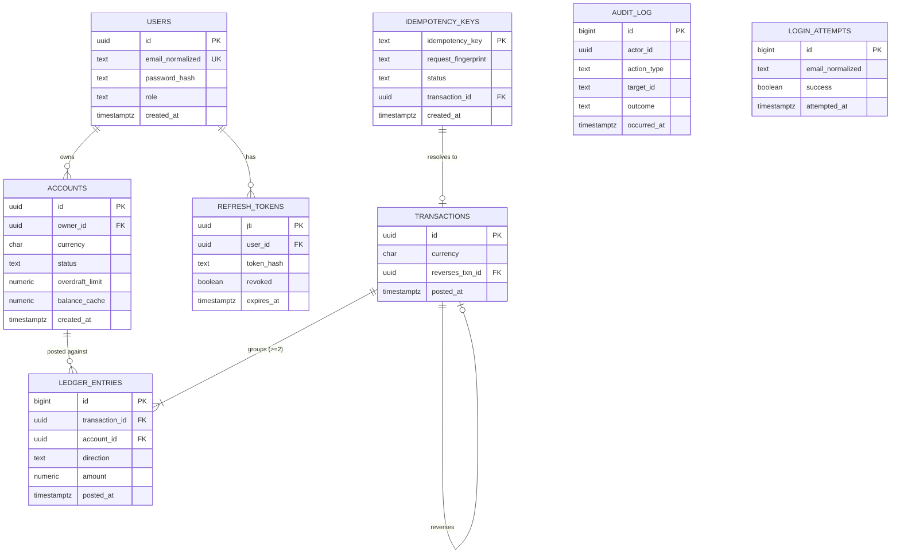
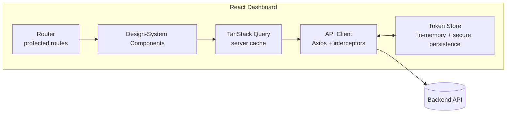

# Design Document: Ledger-Core-Banking

## Overview

Ledger-Core-Banking is a production-grade core banking backend whose defining goal is
**monetary integrity**: every financial event is recorded as a balanced double-entry
transaction, account balances are always derivable from an append-only ledger, and
concurrent balance-changing operations on the same account are serialized so that no
money is ever lost or created.

This design specifies a layered Spring Boot service backed by PostgreSQL, secured with
JWT + OAuth2 password/refresh flows and Role-Based Access Control, and a polished
React/TypeScript dashboard that exercises the engine. The hardest parts of the system —
double-entry posting, PostgreSQL row-level locking with deterministic lock ordering, and
idempotent money movement — are designed in detail below, with each design decision
traced back to the acceptance criteria in `requirements.md`.

### Design Goals (and the requirements that drive them)

| Goal | Mechanism | Requirements |
|------|-----------|--------------|
| Books always reconcile | Double-entry posting; debits == credits invariant; append-only ledger | R5, R9 |
| Balances are authoritative and reproducible | `available_balance = Σcredits − Σdebits` over posted entries only | R4.4, R5.2, R10.3 |
| No lost/duplicated money under concurrency | `SELECT … FOR UPDATE` row locks in ascending account-id order, lock-wait timeout | R7 |
| Retries never move money twice | Idempotency keys with request fingerprinting | R8 |
| Never a partial/corrupt state | Single DB transaction per posting; rollback on any error | R9 |
| Least-privilege access | JWT auth + RBAC (CUSTOMER/TELLER/ADMIN) | R1, R2, R3 |
| Full forensic trail | Append-only audit log written in the same commit as the action | R11 |
| Predictable client contract | Uniform validation + error-code envelope; decimal-string money | R12 |
| Trustworthy, polished UX | Token-managed React dashboard with optimistic-but-safe transfer flow | R13, R14 |

### Technology Stack and Justification

**Backend language/framework: Java 21 + Spring Boot 3.2.**

I evaluated Java/Spring Boot against C#/.NET 8. Both are first-class choices; I chose
Java/Spring Boot for this banking engine for these concrete reasons:

- **Money type.** Java's `java.math.BigDecimal` is the canonical fixed-precision decimal
  type, with explicit `MathContext`/`RoundingMode` control and no implicit binary
  floating-point coercion. This directly serves R5.9 and R12.2 ("SHALL NOT use binary
  floating-point"). (.NET's `decimal` is also excellent; this is a tie.)
- **Pessimistic locking is first-class.** Spring Data JPA exposes
  `@Lock(LockModeType.PESSIMISTIC_WRITE)`, which Hibernate emits as PostgreSQL
  `SELECT … FOR UPDATE`. Per-statement `lock_timeout` is straightforward to set. This is
  exactly the primitive R7 requires.
- **Security maturity.** Spring Security + Spring Authorization Server provide
  battle-tested OAuth2 password/refresh grant handling, method-level `@PreAuthorize`
  RBAC, and JWT signing/verification, covering R1–R3 with well-audited libraries rather
  than hand-rolled crypto (R1.4).
- **Ecosystem fit for banking.** Flyway for versioned, auditable schema migrations;
  HikariCP for connection pooling; the JVM's long track record in tier-1 financial
  systems.
- **Property-based testing.** `jqwik` integrates with JUnit 5 and is well suited to the
  invariants this system must hold (Correctness Properties section).

**Datastore: PostgreSQL 16.** Chosen for strict ACID semantics, MVCC, explicit
row-level locking (`FOR UPDATE`), per-transaction `lock_timeout`, `NUMERIC` exact decimal
type, and strong constraint support (CHECK, UNIQUE, FK, deferrable constraints) used to
enforce ledger invariants at the storage layer (R9).

**Supporting libraries:** Flyway (migrations), HikariCP (pooling), MapStruct (DTO
mapping), Bucket4j or a DB-backed counter (login throttling, R2.9), jjwt/Nimbus (JWT),
Argon2id via Spring Security `Argon2PasswordEncoder` (password hashing, R1.4).

**Frontend: React 18 + TypeScript + Vite**, TanStack Query for server state, React Hook
Form + Zod for typed validation, and a hand-built design-token system (no generic
component-library defaults) to deliver a deliberately polished UI (R13, R14).

---

## Architecture

The system is a layered modular monolith. Layering isolates the transport/API concerns
from domain logic and from persistence, so the correctness-critical ledger and
concurrency logic lives in a thin, well-tested core that does not depend on HTTP or UI
details.

```mermaid
graph TD
    subgraph Client
        DASH[React Dashboard<br/>TypeScript + Vite]
    end

    subgraph API_Layer[API Layer - Spring MVC]
        REST[REST Controllers]
        FILTER[JWT Auth Filter<br/>+ RBAC PreAuthorize]
        VALID[Request Validation<br/>+ Error Envelope]
    end

    subgraph Domain_Layer[Domain Services]
        AUTH[Auth_Service]
        AUTHZ[Authz_Service]
        ACCT[Account_Service]
        LEDGER[Ledger_Service]
        XFER[Transfer_Service]
        IDEM[Idempotency_Service]
        AUDIT[Audit_Service]
    end

    subgraph Persistence[Persistence - Spring Data JPA / JDBC]
        REPOS[Repositories<br/>Pessimistic Locking]
    end

    subgraph DB[(PostgreSQL 16)]
        T_USERS[(users / roles)]
        T_ACCT[(accounts)]
        T_LEDGER[(ledger_entries - append only)]
        T_TXN[(transactions)]
        T_IDEM[(idempotency_keys)]
        T_AUDIT[(audit_log - append only)]
        T_RT[(refresh_tokens)]
    end

    DASH -->|HTTPS + Bearer JWT| FILTER
    FILTER --> VALID --> REST
    REST --> AUTH & AUTHZ & ACCT & LEDGER & XFER
    XFER --> IDEM
    XFER --> LEDGER
    XFER --> ACCT
    AUTH --> AUDIT
    ACCT --> AUDIT
    XFER --> AUDIT
    AUTHZ --> AUDIT
    AUTH --> REPOS
    AUTHZ --> REPOS
    ACCT --> REPOS
    LEDGER --> REPOS
    IDEM --> REPOS
    AUDIT --> REPOS
    REPOS --> DB
```

### Request Lifecycle (cross-cutting)

1. **Authentication** — A servlet filter extracts the `Authorization: Bearer <jwt>`
   header, verifies signature and expiry, and populates the security context. Malformed,
   expired, or unsigned tokens are rejected before any controller runs (R2.5).
2. **Authorization** — Method-level `@PreAuthorize` plus an ownership check in
   `Authz_Service` enforces role and ownership rules before domain logic executes (R3).
3. **Validation** — Bean Validation + custom validators reject malformed bodies, bad
   currencies, and bad amounts, producing a field-level error envelope and making no
   state change (R12).
4. **Domain execution** — A single `@Transactional` boundary wraps balance-changing
   operations, guaranteeing all-or-nothing persistence (R9).
5. **Audit** — Sensitive actions write an audit entry inside the same transaction as the
   action, so an action cannot be reported successful unless its audit row also commits
   (R11.6).

### Transaction & Isolation Strategy

Balance-changing operations run at **READ COMMITTED** isolation combined with
**explicit pessimistic row locks** (`SELECT … FOR UPDATE`). Rationale:

- Locking the affected account rows and re-reading their balances inside the transaction
  prevents **lost updates** and gives **repeatable reads of the locked rows**, satisfying
  R9.3, without the throughput cost and retry churn of full SERIALIZABLE for every
  request.
- Dirty reads are impossible under PostgreSQL MVCC at READ COMMITTED.
- Deterministic lock ordering (ascending account id) prevents deadlock (R7.6), and a
  per-transaction `lock_timeout` bounds waiting (R7.7).

SERIALIZABLE is documented as an available fallback (set per-transaction) for any future
operation that cannot express its contention as a fixed set of row locks; such operations
would retry on serialization failure (SQLState 40001). For the money-movement paths
specified here, pessimistic locking is the chosen approach because R7.2 and R7.6 mandate
ordered, FIFO lock acquisition semantics that map directly onto `FOR UPDATE`.

---

## Components and Interfaces

Each domain service is a Spring `@Service`. Repositories are Spring Data JPA interfaces.
Interfaces below are expressed in language-neutral signatures; types like `Money` denote a
`{ amount: BigDecimal, currency: ISO4217 }` value object.

### Auth_Service (R1, R2)

```
register(email, password) -> { userId, role=CUSTOMER }            // R1.1
login(email, password) -> { accessToken, refreshToken } | AuthError // R2.1, R2.2, R2.9
refresh(refreshToken) -> { accessToken } | AuthError              // R2.4, R2.8
logout(refreshToken) -> void                                      // R2.6
verifyAccessToken(jwt) -> Principal | AuthError                   // R2.5
```

- Passwords hashed with Argon2id; never stored reversibly (R1.4). Password policy: 12–128
  chars, ≥1 letter and ≥1 digit (R1.5), validated before hashing.
- Email normalized to lowercase for uniqueness comparison (R1.2) and validated for a
  single `@`, non-empty local part, and a domain part containing a `.` (R1.6).
- Access tokens expire 15 min after issuance (R2.3); refresh tokens 7 days (R2.7).
- Login responses for nonexistent vs. wrong-password are byte-identical (R2.2). Failed
  attempts are counted per normalized email in a sliding 15-minute window; 5 failures lock
  that email for 15 minutes (R2.9).
- Refresh tokens are persisted as hashes with a `jti` and `revoked` flag; logout and
  reuse-after-invalidate are enforced via DB lookup (R2.6, R2.8).

### Authz_Service (R3)

```
authorizeAccountAccess(principal, accountId, mode) -> void | AuthzError   // R3.2, R3.3, R3.8
authorizePost(principal) -> void | AuthzError                             // R3.7
changeUserRole(adminPrincipal, targetUserId, newRole) -> void | Error     // R3.6, R3.9
```

- Every user has exactly one role from {CUSTOMER, TELLER, ADMIN} (R3.1).
- CUSTOMER may access only owned accounts (R3.2); TELLER may read any account (R3.3) and
  post transfers on behalf of customers (R3.7); ADMIN may read all accounts/ledgers (R3.8)
  and manage roles (R3.4). Role changes are audited with previous/new role, actor, and
  timestamp (R3.6). Invalid role values or unknown target users are rejected (R3.9).

### Account_Service (R4)

```
openAccount(ownerId, currency) -> Account                 // R4.1, R4.2, R4.8
viewAccount(accountId) -> AccountView                     // R4.3, R4.9
closeAccount(accountId) -> void | ValidationError         // R4.5, R4.6, R4.9, R4.10
getAvailableBalance(accountId) -> Money                   // R4.4
```

- New accounts start ACTIVE with zero balance and an immutable currency (R4.1, R4.2).
- Balance is **always** computed from posted ledger entries, never stored as a mutable
  field of record (R4.4) — a materialized `balance` column may exist as a cache but is
  treated as derived and reconcilable.
- Close requires zero balance and ACTIVE status; otherwise rejected (R4.5, R4.6, R4.10).
  Money movement against a CLOSED account is rejected (R4.7).

### Ledger_Service (R5, R9, R10)

```
postTransaction(entries[], currency, reference?) -> TransactionId | ValidationError  // R5.1-R5.6, R9
reverseTransaction(originalTxnId, actor) -> TransactionId                            // R5.8
listEntries(accountId, dateRange?, page) -> Page<LedgerEntry>                        // R10.1-R10.7
statement(accountId, dateRange?, page) -> Page<StatementLine>                        // R10.3
```

- Posting validates: ≥1 debit and ≥1 credit (R5.6); Σdebits == Σcredits (R5.2, R5.3);
  single shared currency (R5.4, R5.5). All entries persist in one DB transaction (R9.1).
- Entries are append-only; corrections are new reversing transactions referencing the
  original (R5.7, R5.8).
- Queries return entries ordered by `(posted_at ASC, id ASC)` (R10.1); statements include
  a running balance equal to the cumulative sum through each entry (R10.3); date range and
  cursor pagination (1–500, default 50) are validated (R10.2, R10.4, R10.6, R10.7).

### Transfer_Service (R6, R7, R8)

This is the concurrency- and idempotency-critical orchestrator. Algorithm detailed in
[The Funds-Transfer & Locking Algorithm](#the-funds-transfer--locking-algorithm).

```
transfer(principal, idempotencyKey, sourceId, destId, amount, currency) -> TransferResult
```

### Idempotency_Service (R8)

```
begin(key, fingerprint) -> BEGUN | DUPLICATE_IN_PROGRESS | REPLAY(result) | CONFLICT
complete(key, transactionId) -> void
```

- `fingerprint = hash(sourceId, destId, amount, currency)`. New key → record IN_PROGRESS
  (R8.1). Matching key + matching fingerprint + COMPLETED → replay original result, post
  nothing (R8.2). Matching key + IN_PROGRESS → conflict (R8.3). Matching key + different
  fingerprint → conflict (R8.4). Missing/ill-formed key (not 1–128 chars) → validation
  error (R8.5). Records retained ≥24h (R8.6).

### Audit_Service (R11)

```
record(actor, actionType, targetId, outcome, timestamp) -> void | AuditFailure
queryAudit(adminPrincipal, filter, page) -> Page<AuditEntry>   // R11.3
```

- Append-only; updates/deletes denied (R11.2, R11.4). Records auth attempts (success and
  failure), account open/close, transfers, and role changes with actor, action, target,
  outcome, and millisecond-precision timestamp (R11.1). Queries are ADMIN-only and ordered
  by `(timestamp ASC, id ASC)` deterministically (R11.3). If an audit row for a sensitive
  action cannot be durably persisted, the action is not reported successful (R11.6) —
  achieved by writing the audit row in the same transaction as the action.

### API Layer

REST controllers expose the services over HTTPS/JSON. Representative endpoints:

| Method & Path | Service | Auth | Requirements |
|---|---|---|---|
| `POST /api/v1/auth/register` | Auth | public | R1 |
| `POST /api/v1/auth/login` | Auth | public | R2.1, R2.2, R2.9 |
| `POST /api/v1/auth/refresh` | Auth | refresh token | R2.4, R2.8 |
| `POST /api/v1/auth/logout` | Auth | refresh token | R2.6 |
| `POST /api/v1/accounts` | Account | CUSTOMER+ | R4.1 |
| `GET /api/v1/accounts/{id}` | Account | owner/TELLER/ADMIN | R4.3, R3.2, R3.3 |
| `POST /api/v1/accounts/{id}/close` | Account | owner/ADMIN | R4.5 |
| `POST /api/v1/transfers` | Transfer | owner/TELLER | R6, R7, R8 |
| `GET /api/v1/accounts/{id}/entries` | Ledger | owner/TELLER/ADMIN | R10.1, R10.2, R10.4 |
| `GET /api/v1/accounts/{id}/statement` | Ledger | owner/TELLER/ADMIN | R10.3 |
| `PUT /api/v1/users/{id}/role` | Authz | ADMIN | R3.6, R3.9 |
| `GET /api/v1/audit` | Audit | ADMIN | R11.3 |

All money fields are decimal strings with an explicit ISO 4217 currency (R12.2). The
`POST /api/v1/transfers` request carries the `Idempotency-Key` header (R8, R14.2).

---

## Data Models

### Entity-Relationship Overview



### Schema Details and Constraints

**`accounts`** — `status ∈ {ACTIVE, CLOSED}`; `currency` is `CHAR(3)` and immutable (no
UPDATE path exposes it, R4.2); `overdraft_limit NUMERIC(38,4) NOT NULL DEFAULT 0`;
`balance_cache` is a derived/reconcilable cache, authoritative balance is the sum over
`ledger_entries` (R4.4). CHECK: `overdraft_limit >= 0`.

**`transactions`** — Groups ledger entries; `currency CHAR(3)`; `reverses_txn_id`
nullable self-FK (R5.8); `posted_at timestamptz` with millisecond precision.

**`ledger_entries`** — Append-only.
- `direction ∈ {DEBIT, CREDIT}`; `amount NUMERIC(38,4) NOT NULL CHECK (amount > 0)` —
  amounts are strictly positive, direction carries the sign (R5.9 fixed-precision, no
  floating point).
- No `UPDATE`/`DELETE` grants on this table at the DB role level; the application never
  issues updates (R5.7).
- Index `(account_id, posted_at, id)` to serve ordered queries and running balance
  (R10.1, R10.3).
- **Balance convention:** `available_balance(account) = Σ amount[CREDIT] − Σ amount[DEBIT]`
  over the account's posted entries. A transfer **debits the source** (reduces source
  balance) and **credits the destination** (increases destination balance), consistent
  with R6.1 and R6.4.

**`idempotency_keys`** — `idempotency_key` PK (1–128 chars, R8.5);
`status ∈ {IN_PROGRESS, COMPLETED}`; `request_fingerprint TEXT`; `transaction_id`
nullable FK; `created_at` used for ≥24h retention (R8.6). The PK provides the
single-winner guarantee under concurrent duplicates.

**`refresh_tokens`** — Stored as a hash with `jti`, `revoked`, `expires_at` (R2.6, R2.7,
R2.8).

**`audit_log`** — Append-only; no UPDATE/DELETE grants (R11.2, R11.4); ordered by
`(occurred_at, id)` (R11.3); `occurred_at` millisecond precision (R11.1).

**`login_attempts`** — Sliding-window record of attempts per normalized email for lockout
(R2.9).

### Money Representation

All monetary values use PostgreSQL `NUMERIC(38,4)` and Java `BigDecimal`. The API
transports amounts as **decimal strings** (e.g. `"100.00"`) with an explicit ISO 4217
currency code (R12.2). Amount scale must not exceed the currency's minor-unit precision
(e.g. 2 for USD); over-precise amounts are rejected (R12.3). No binary floating-point type
appears anywhere in the money path (R5.9).

---

## The Double-Entry Posting Algorithm

`Ledger_Service.postTransaction` is the single chokepoint through which all ledger
mutations flow. It is the place the bookkeeping invariants (R5) are enforced.

```
postTransaction(entries, currency, reference):
    # --- Pure validation (no state change on failure) ---
    assert entries.length >= 2                                  # R5.1
    assert exists e in entries where e.direction == DEBIT       # R5.6
    assert exists e in entries where e.direction == CREDIT      # R5.6
    assert all e.currency == currency for e in entries          # R5.4 / R5.5
    debits  = sum(e.amount for e where direction == DEBIT)
    credits = sum(e.amount for e where direction == CREDIT)
    assert debits == credits                                    # R5.2 / R5.3 (balanced)

    # --- Persist atomically (R9.1) ---
    txn = insert transactions(currency, reference, posted_at = now_ms())
    for e in entries:
        insert ledger_entries(txn.id, e.account_id, e.direction, e.amount, txn.posted_at)
    return txn.id
```

Key properties of this algorithm:

- **Balanced by construction.** The function refuses to persist anything unless
  `Σdebits == Σcredits`. Because every persisted transaction is balanced and the
  system-wide balance is the sum over all entries, the **sum of all account balances in a
  single currency is invariant** under posting (it only changes via external
  deposit/withdrawal transactions that intentionally use a designated external/clearing
  account). This is the heart of monetary integrity.
- **Append-only.** No code path updates or deletes `ledger_entries`; the DB role lacks
  those grants (R5.7). Corrections call `reverseTransaction`, which posts a new balanced
  transaction with each entry's direction flipped and equal amounts, referencing the
  original transaction id (R5.8).
- **Atomic.** The whole function body runs inside one `@Transactional` boundary. Any
  failure rolls everything back, leaving balances untouched (R9.1, R9.2).
- **Decimal-exact.** `BigDecimal` arithmetic with the currency's scale; equality is value
  equality at the currency scale, never floating-point comparison (R5.9).

### Reversal (Correction)

```
reverseTransaction(originalTxnId, actor):
    original = load transactions(originalTxnId) with its entries
    reversingEntries = [ {account_id: e.account_id,
                          direction: flip(e.direction),     # DEBIT<->CREDIT
                          amount: e.amount} for e in original.entries ]
    newTxn = postTransaction(reversingEntries, original.currency,
                             reference = "reversal-of:" + originalTxnId)
    set newTxn.reverses_txn_id = originalTxnId
    audit(actor, REVERSAL, originalTxnId, SUCCESS)
    return newTxn.id
```

A reversal is itself balanced, so it preserves every invariant while never mutating the
original entries (R5.8).

---

## The Funds-Transfer & Locking Algorithm

`Transfer_Service.transfer` composes idempotency, RBAC, account validation, row-level
locking, the overdraft check, and atomic posting. This is where R6, R7, R8, and R9
intersect.

```mermaid
sequenceDiagram
    participant C as Client/Dashboard
    participant T as Transfer_Service
    participant I as Idempotency_Service
    participant DB as PostgreSQL

    C->>T: transfer(key, src, dst, amount, ccy)
    T->>T: validate amount>0, src!=dst, ccy match (R6.2/R6.3/R6.5)
    T->>DB: BEGIN (READ COMMITTED); SET LOCAL lock_timeout = '5s'
    T->>I: begin(key, fingerprint)
    alt key replay (COMPLETED, same fingerprint)
        I-->>T: REPLAY(originalResult)
        T-->>C: original result (no new txn)  %% R8.2
    else key conflict (in-progress or different fingerprint)
        I-->>T: CONFLICT
        T-->>C: 409 conflict  %% R8.3 / R8.4
    else new key
        I-->>DB: INSERT idempotency_keys(... IN_PROGRESS)  %% R8.1
        Note over T,DB: Lock accounts in ASCENDING id order (R7.6)
        T->>DB: SELECT ... FROM accounts WHERE id = least(src,dst) FOR UPDATE
        T->>DB: SELECT ... FROM accounts WHERE id = greatest(src,dst) FOR UPDATE
        T->>DB: verify both ACTIVE (R4.7), recompute source balance
        alt source balance - amount < -overdraft_limit
            T->>DB: ROLLBACK
            T-->>C: insufficient funds  %% R6.4 / R7.4
        else sufficient
            T->>DB: postTransaction([debit src, credit dst])  %% R5/R6.1
            T->>I: complete(key, txnId)  %% R8.1
            T->>DB: audit(actor, TRANSFER, txnId, SUCCESS)  %% R11.1
            T->>DB: COMMIT  %% R6.6 / R9.1
            T-->>C: { transactionId }  %% R6.1
        end
    end
```

### Step-by-step

1. **Pre-lock validation** (pure, no state change on failure): amount strictly positive
   (R6.2), source ≠ destination (R6.5), currencies match (R6.3), idempotency key is
   1–128 chars (R8.5). Failure returns a validation error and changes nothing (R6.8).
2. **Open transaction** at READ COMMITTED and `SET LOCAL lock_timeout` to the configured
   value (default 5s, range 1–30s, R7.7).
3. **Idempotency gate** (R8): attempt to claim the key. The `idempotency_keys` primary key
   guarantees exactly one concurrent claimer; losers see IN_PROGRESS → conflict (R8.3).
   Replays with a matching fingerprint return the original result (R8.2); mismatched
   fingerprints conflict (R8.4).
4. **Deterministic locking** (R7.6): compute `lockOrder = sort([sourceId, destId] ascending)`
   and acquire `FOR UPDATE` locks **one at a time in that order**. Because every transfer
   uses the same global ordering, two transfers touching the same pair of accounts can
   never hold-and-wait in a cycle → no deadlock. Lock acquisition is FIFO per PostgreSQL's
   lock queue, satisfying ordered waiting (R7.2). Held until commit/abort (R7.1).
5. **Existence/status checks**: nonexistent account → not-found (R6.7); CLOSED account →
   validation error (R4.7).
6. **Authoritative balance read**: with the source row locked, recompute the source's
   available balance from posted ledger entries (or read the reconciled `balance_cache`
   under the lock). Because the row is locked, no concurrent transaction can change it
   until we commit, preventing lost updates (R9.3).
7. **Overdraft check** (R6.4, R7.4): if `sourceBalance − amount < −overdraftLimit`, abort
   with an insufficient-funds error; persist nothing (R6.8, R7.5).
8. **Post** one balanced transaction debiting source and crediting destination via
   `postTransaction` (R6.1).
9. **Complete idempotency record** with the resulting transaction id (R8.1) and **write the
   audit entry** in the same transaction (R11.1, R11.6).
10. **Commit** — both ledger entries become durable together or not at all (R6.6, R9.1,
    R9.4). On any failure between BEGIN and COMMIT, PostgreSQL rolls the whole transaction
    back, restoring all balances (R6.8, R7.5, R9.2, R9.5).

### Concurrency correctness argument

For any set of concurrent balance-changing requests on one account, each must acquire that
account's `FOR UPDATE` lock before reading or changing its balance. PostgreSQL grants the
lock to one transaction at a time, in request order, so the operations are **forced into a
serial order** on that account. Each operation re-reads the balance under the lock and
applies its overdraft check against the up-to-date value. Therefore the committed final
balance equals the result of applying the committed transactions in that serial order, and
the sum of committed debits/credits equals the net change with zero discrepancy (R7.3).
When only a subset of withdrawals can stay within the overdraft limit, exactly those
commit and the rest are rejected with insufficient-funds, because each sees the balance
left by its predecessors (R7.4).

### Lock-wait timeout and deadlock handling

`lock_timeout` bounds how long any `FOR UPDATE` waits. On timeout PostgreSQL raises
SQLState `55P03` (lock_not_available); the service catches it, rolls back (restoring all
balances), and returns a **retryable** error (R7.7). Deterministic ascending lock ordering
makes a deadlock cycle impossible for the money paths; should PostgreSQL's detector ever
fire `40P01`, it is likewise translated to a retryable error and the transaction rolls
back cleanly.

---

## Security & Authentication Design

- **Password storage (R1.4):** Argon2id via Spring Security `Argon2PasswordEncoder`, per-
  user salt, tuned cost parameters. Plaintext/reversible storage never occurs.
- **Token model (R2):** Access JWT signed with RS256, 15-minute TTL (R2.3), carrying
  `sub` (user id) and `role`. Refresh tokens are opaque, persisted as hashes with a `jti`,
  7-day TTL (R2.7), `revoked` flag for logout/invalidate (R2.6, R2.8).
- **User enumeration resistance (R2.2, R13.2):** login and refresh failures return one
  generic authentication error; the login path performs a constant-time password
  comparison (and a dummy hash when the email is unknown) so timing does not reveal email
  existence.
- **Brute-force throttle (R2.9):** 5 failed attempts for the same normalized email within
  15 minutes locks that email for 15 minutes, recorded in `login_attempts`.
- **RBAC (R3):** `@PreAuthorize` for role gates plus an ownership predicate for CUSTOMER
  account access; ADMIN-only role management and audit access; TELLER read-any and
  post-on-behalf. Denials change no state and return an authorization error (R3.2, R3.5).
- **Transport:** HTTPS only; JWT in `Authorization: Bearer`. CORS restricted to the
  dashboard origin.

---

## Frontend Architecture and Design System

The dashboard is a deliberate, polished product surface — not a generic scaffold. It is a
React 18 + TypeScript SPA built with Vite.

### Architecture



- **Token lifecycle (R13):** on login, store access + refresh tokens (R13.1); attach the
  access token to every request via an Axios request interceptor (R13.3). A response
  interceptor catches `401`, transparently calls `/auth/refresh`, and retries the original
  request once (R13.4). If refresh fails, it clears tokens and routes to login (R13.5).
  Logout invalidates the refresh token server-side and clears local tokens (R13.6).
- **Transfer flow (R14):** the transfer form generates a UUID `Idempotency-Key` per
  submission (R14.2), disables the submit control while in flight (R14.3), and re-enables
  it on success or failure (R14.4). Success shows a confirmation and the updated balances
  via query invalidation (R14.5); insufficient-funds shows a specific, non-destructive
  message (R14.6); a 30-second client timeout shows a timeout message and leaves balances
  unchanged (R14.7).
- **Account views (R14.1, R14.8–R14.11):** home lists owned accounts with currency and
  balance (loading target < 3s), with an empty state when none exist (R14.10); history
  shows ledger entries with running balance, 50 per page (R14.8); all money is rendered
  with the currency's symbol and precision (R14.9, R14.11 responsive < 768px).

### Design System (anti-"AI slop")

A small, intentional token set drives a calm, trustworthy financial aesthetic:

- **Type:** one humanist sans (e.g. Inter) with a deliberate modular scale; tabular
  lining numerals for all monetary figures so columns align.
- **Color:** a restrained neutral base with a single deep accent; semantic colors for
  positive/negative balance movements that meet WCAG AA contrast.
- **Space & rhythm:** an 8px spacing grid; generous whitespace; content max-widths for
  readability.
- **Motion:** short, purposeful transitions (150–200ms) on state changes only; no gratuitous
  animation.
- **Components:** hand-built Button, Input, Card, Table, Toast, Modal, and Money components
  with consistent focus states and full keyboard accessibility.

Note: full accessibility conformance (WCAG) requires manual testing with assistive
technologies and expert review; the design targets AA contrast and keyboard operability as
a baseline.

---

## Correctness Properties

*A property is a characteristic or behavior that should hold true across all valid
executions of a system — essentially, a formal statement about what the system should do.
Properties serve as the bridge between human-readable specifications and machine-verifiable
correctness guarantees.*

This system is highly amenable to property-based testing: the ledger, balance, posting,
overdraft, idempotency, validation, and serialization logic are pure or near-pure
functions with universal invariants over large input spaces. The properties below were
derived from the prework analysis and consolidated to remove redundancy. Each is annotated
with the requirements it validates. Criteria classified as INTEGRATION, SMOKE, EXAMPLE, or
pure UI behavior are covered by the Testing Strategy section rather than as properties.

### Property 1: Valid registration creates exactly one CUSTOMER

*For any* well-formed email and policy-compliant password, registration creates exactly
one User with role CUSTOMER and returns that User's identifier.

**Validates: Requirements 1.1**

### Property 2: Password policy is enforced

*For any* password string, registration is accepted if and only if the password is 12–128
characters and contains at least one letter and at least one digit; rejected passwords
create no User and the error names each unmet criterion.

**Validates: Requirements 1.3, 1.5**

### Property 3: Email well-formedness is enforced and uniqueness is case-insensitive

*For any* email string, registration is accepted only if the email has a single "@" with a
non-empty local part and a domain part containing a ".", and *for any* already-registered
email, registration with any case-variant of it is rejected as a conflict with no new User
created.

**Validates: Requirements 1.2, 1.6**

### Property 4: Passwords are stored only as irreversible hashes

*For any* password, the stored credential is never equal to the plaintext and is not
reversible, yet verifying the original password against the stored hash succeeds.

**Validates: Requirements 1.4**

### Property 5: Authentication is enumeration-resistant

*For any* login attempt against an unknown email and *any* login attempt against a known
email with an incorrect password, the rejection responses are identical (same code and
message), revealing no information about email existence.

**Validates: Requirements 2.2**

### Property 6: Token lifetimes are exact

*For any* issued Access_Token, its expiry equals its issuance time plus 15 minutes, and
*for any* issued Refresh_Token, its expiry equals its issuance time plus 7 days.

**Validates: Requirements 2.3, 2.7**

### Property 7: Refresh-token validity round-trip

*For any* freshly issued, unexpired, non-invalidated Refresh_Token, a refresh request
yields a valid new Access_Token; and *for any* Refresh_Token that is expired, malformed,
signature-invalid, or invalidated (including via logout), a refresh request is rejected and
issues no Access_Token.

**Validates: Requirements 2.4, 2.6, 2.8**

### Property 8: Login lockout after repeated failures

*For any* sequence of login attempts for a single email, once 5 failures occur within any
15-minute window, all further attempts for that email are rejected for 15 minutes.

**Validates: Requirements 2.9**

### Property 9: RBAC decisions match the role/ownership matrix and denials are side-effect free

*For any* principal (with role in {CUSTOMER, TELLER, ADMIN}), action, and target resource,
the authorization decision equals the defined permission matrix — CUSTOMER may access only
owned accounts, TELLER may read any account and post transfers, ADMIN may read all accounts
and manage roles — and *for any* denied request, the targeted Account and ledger records
are left unchanged.

**Validates: Requirements 3.1, 3.2, 3.3, 3.4, 3.5, 3.7, 3.8, 10.5**

### Property 10: Role changes are valid-only and audited

*For any* role-change request, it succeeds only if the actor is ADMIN, the target User
exists, and the new role is in {CUSTOMER, TELLER, ADMIN}; on success an audit entry
records the previous role, new role, acting ADMIN, and timestamp; otherwise the target
User's role is unchanged.

**Validates: Requirements 3.6, 3.9**

### Property 11: New accounts satisfy opening invariants

*For any* request specifying a supported ISO 4217 currency, the created Account has a zero
balance, status ACTIVE, and an identifier unique across all accounts; requests with an
unsupported currency create no Account.

**Validates: Requirements 4.1, 4.8**

### Property 12: Account currency is immutable

*For any* Account and *any* sequence of subsequent operations, the Account's currency
equals the currency assigned at creation.

**Validates: Requirements 4.2**

### Property 13: Available balance is derived solely from posted entries

*For any* Account and *any* set of posted Ledger_Entries for it, the Account's
Available_Balance equals the sum of credit amounts minus the sum of debit amounts over
those entries, and nothing else.

**Validates: Requirements 4.4, 5.2**

### Property 14: Account closure rules

*For any* Account, a close request succeeds if and only if the Account is ACTIVE with a
zero Available_Balance; a close request against a non-zero-balance or already-CLOSED
Account is rejected and leaves the status unchanged.

**Validates: Requirements 4.5, 4.6, 4.10**

### Property 15: Closed accounts reject money movement

*For any* money-movement request targeting a CLOSED Account, the request is rejected and
the Account is left unchanged.

**Validates: Requirements 4.7**

### Property 16: Posting is accepted iff well-formed, else nothing is persisted

*For any* candidate set of Ledger_Entries, the posting is accepted if and only if it
contains at least two entries with at least one debit and at least one credit, all entries
share one currency, and the sum of debit amounts equals the sum of credit amounts; when
rejected, no Ledger_Entry is persisted.

**Validates: Requirements 5.1, 5.3, 5.4, 5.5, 5.6**

### Property 17: The ledger is append-only

*For any* posted Ledger_Entry and *any* sequence of subsequent system operations, the
original entry's fields remain unchanged and the entry is never deleted.

**Validates: Requirements 5.7**

### Property 18: Reversal nets to zero and preserves the original

*For any* posted Transaction, posting its reversal produces entries equal in amount and
opposite in direction that reference the original Transaction's identifier, such that the
net effect on every affected Account's balance is zero and the original entries remain
unchanged.

**Validates: Requirements 5.8**

### Property 19: Monetary arithmetic is decimal-exact

*For any* set of monetary amounts in a given currency, summing and differencing them
preserves the currency's fixed decimal scale exactly, with no binary floating-point drift.

**Validates: Requirements 5.9**

### Property 20: A valid transfer posts a single balanced debit/credit and conserves value

*For any* valid Transfer (existing distinct ACTIVE same-currency accounts, positive amount
within overdraft), exactly one balanced Transaction is posted that debits the source by the
amount and credits the destination by the amount, the sum of the two accounts' balance
changes is zero, and a Transaction identifier is returned.

**Validates: Requirements 6.1, 6.6, 9.1**

### Property 21: Invalid transfers are rejected and side-effect free

*For any* Transfer request that has a non-positive amount, mismatched currencies, or an
identical source and destination, the request is rejected and both accounts' balances and
the ledger entry count are left unchanged.

**Validates: Requirements 6.2, 6.3, 6.5, 6.8**

### Property 22: Overdraft limit is never breached (single or concurrent)

*For any* set of withdrawal/transfer requests against an Account (applied individually or
concurrently), a request commits only if it keeps the Available_Balance at or above the
negative of the Overdraft_Limit; requests that would breach it are rejected with an
insufficient-funds error and cause no balance change.

**Validates: Requirements 6.4, 7.4, 7.5**

### Property 23: Concurrent balance changes are serializable and conserve value

*For any* set of concurrent balance-changing requests on a single Account, the committed
final Available_Balance equals the result of applying the committed Transactions in some
serial order, and the sum of all committed debits and credits equals the net change in
Available_Balance with zero discrepancy.

**Validates: Requirements 7.3, 9.3**

### Property 24: Lock acquisition order is deterministic and ascending

*For any* set of Account identifiers that must be locked within one Transaction, the
computed lock-acquisition order is the identifiers sorted in ascending order with no
duplicates.

**Validates: Requirements 7.6**

### Property 25: Money movement is atomic under failure

*For any* posting that encounters a failure after some but not all entries are written,
the entire database transaction rolls back so that no Ledger_Entry is persisted and every
affected Account's balance is unchanged, and an error indicating non-persistence is
returned.

**Validates: Requirements 6.6, 9.2**

### Property 26: Idempotent replay yields one transaction

*For any* Transfer request submitted any number of times with the same well-formed
Idempotency_Key and identical parameters, exactly one Transaction is posted and every
response returns that same original result.

**Validates: Requirements 8.1, 8.2**

### Property 27: Idempotency-key conflicts are rejected

*For any* Transfer request whose Idempotency_Key matches a previously recorded request but
whose parameters differ, the request is rejected with a conflict error and no Transaction
is posted.

**Validates: Requirements 8.4**

### Property 28: Idempotency-key format is enforced

*For any* money-movement request, it is accepted only if the Idempotency_Key is a string of
1 to 128 characters; otherwise it is rejected with a validation error.

**Validates: Requirements 8.5**

### Property 29: Ledger queries are deterministically ordered

*For any* set of Ledger_Entries, a query returns them ordered by posting time ascending,
breaking ties by entry identifier ascending.

**Validates: Requirements 10.1**

### Property 30: Date-range filtering is exact

*For any* set of Ledger_Entries and *any* valid date range, the query returns exactly those
entries whose posting time is on or after the start and on or before the end.

**Validates: Requirements 10.2**

### Property 31: Statement running balance equals the prefix sum

*For any* ordered sequence of an Account's posted Ledger_Entries, the running balance
reported after each entry equals the cumulative signed sum of all entries up to and
including that entry.

**Validates: Requirements 10.3**

### Property 32: Pagination is bounded and lossless

*For any* set of Ledger_Entries and *any* page size in [1, 500] (default 50), each returned
page contains at most the page size, and concatenating all pages via the returned cursors
reproduces the complete ordered result set exactly once with no omissions or duplicates.

**Validates: Requirements 10.4**

### Property 33: Sensitive actions produce complete audit entries atomically

*For any* sensitive action (authentication success/failure, account open/close, transfer
posted, role change), a matching append-only audit entry is recorded with the actor, action
type, target identifier, outcome, and a millisecond-precision timestamp; and if the audit
entry cannot be durably persisted, the action is not reported successful (it rolls back
with the audit write).

**Validates: Requirements 11.1, 11.6**

### Property 34: The audit log is append-only and admin-queryable in deterministic order

*For any* audit entry, no operation updates or deletes it; and *for any* set of audit
entries, an authorized ADMIN query returns them ordered by timestamp ascending with ties
broken by a deterministic secondary key, while non-ADMIN requests are denied.

**Validates: Requirements 11.2, 11.3, 11.4**

### Property 35: Malformed requests are rejected with field-level detail and no state change

*For any* API request with a malformed body or missing required fields, the request is
rejected, no System state changes, and the error identifies each invalid or missing field.

**Validates: Requirements 12.1**

### Property 36: Currency codes are validated

*For any* request specifying a currency, it is accepted only if the value is a supported
ISO 4217 three-letter code; otherwise it is rejected with an error identifying the currency
field.

**Validates: Requirements 4.8, 12.6**

### Property 37: Amount validation enforces non-negativity and currency precision

*For any* request specifying an amount, it is accepted only if the amount is a valid
non-negative decimal string whose scale does not exceed the currency's minor-unit
precision; otherwise it is rejected with an error identifying the amount field.

**Validates: Requirements 12.3, 12.7**

### Property 38: Money serialization round-trip preserves value

*For any* Money value, serializing it to its decimal-string-plus-currency API
representation and parsing it back yields an equal Money value at the currency's scale.

**Validates: Requirements 12.2**

### Property 39: Response envelope is well-formed

*For any* error response, it contains a machine-readable error code from the defined set
and a human-readable message; *for any* success response, it contains no error code and no
error message.

**Validates: Requirements 12.4, 12.5**

### Property 40: Dashboard generates a well-formed unique idempotency key per submission

*For any* sequence of Transfer submissions from the Dashboard, each generates an
Idempotency_Key that is a string of 1 to 128 characters and is distinct across distinct
submissions.

**Validates: Requirements 14.2**

### Property 41: Money rendering uses the currency's symbol and precision

*For any* Money value, the Dashboard renders it using the symbol and exact minor-unit
decimal precision defined by its currency.

**Validates: Requirements 14.9**

---

## Error Handling

All errors are returned through a single uniform envelope so clients can handle failures
predictably (R12.4, R12.5). Success responses never carry error fields.

```json
// Error
{ "error": { "code": "INSUFFICIENT_FUNDS",
             "message": "Available balance is insufficient for the requested amount.",
             "fields": [ { "field": "amount", "issue": "exceeds available balance" } ] } }

// Success (no error code or message)
{ "data": { "transactionId": "..." } }
```

### Error-code catalog (machine-readable, defined set)

| Code | HTTP | Meaning | Requirements |
|------|------|---------|--------------|
| `VALIDATION_ERROR` | 400 | Malformed body, missing/invalid field, bad amount/currency precision | R12.1, R12.3, R12.6, R12.7, R5.3, R5.5, R5.6, R6.2, R6.3, R6.5 |
| `INVALID_IDEMPOTENCY_KEY` | 400 | Missing or non-1..128-char key | R8.5 |
| `INVALID_DATE_RANGE` | 400 | start > end | R10.6 |
| `INVALID_CURSOR` | 400 | Bad/expired pagination cursor | R10.7 |
| `AUTHENTICATION_ERROR` | 401 | Bad credentials, bad/expired token, locked out (generic) | R2.2, R2.5, R2.8, R2.9 |
| `AUTHORIZATION_ERROR` | 403 | Role/ownership denial | R3.2, R3.5, R10.5, R11.4 |
| `NOT_FOUND` | 404 | Unknown account/user | R4.9, R6.7 |
| `CONFLICT` | 409 | Duplicate email; idempotency in-progress/param mismatch | R1.2, R8.3, R8.4 |
| `INSUFFICIENT_FUNDS` | 422 | Would breach overdraft limit | R6.4, R7.4 |
| `ACCOUNT_CLOSED` | 422 | Movement against closed account; non-zero close | R4.6, R4.7, R4.10 |
| `LEDGER_IMBALANCE` | 422 | Debits != credits | R5.3 |
| `RETRYABLE_CONFLICT` | 503 | Lock-wait timeout / deadlock; safe to retry | R7.7 |
| `PERSISTENCE_ERROR` | 500 | DB error; transaction rolled back, nothing persisted | R9.2, R11.5, R11.6 |

### Handling principles

- **No partial state.** Every rejection path leaves System state unchanged (R6.8, R7.5,
  R9.2, R12.1). This is guaranteed structurally by performing validation before any write
  and by wrapping all writes in a single transaction.
- **Generic auth errors.** Authentication failures never distinguish unknown-email from
  wrong-password and never reveal lockout vs. bad-password specifics beyond a generic
  message (R2.2, R13.2).
- **Retryable vs. terminal.** Lock-wait timeouts and deadlock aborts return
  `RETRYABLE_CONFLICT`; clients (and the dashboard) may retry with the same
  Idempotency_Key safely because of Property 26 (R7.7, R8.2).
- **Audit-coupled failures.** If the audit write fails, the enclosing action's transaction
  rolls back and the action returns `PERSISTENCE_ERROR`; it is never reported successful
  (R11.6).
- **Frontend mapping.** The dashboard maps `INSUFFICIENT_FUNDS` to a specific funds message
  (R14.6), a 30-second client timeout to a timeout message (R14.7), and `AUTHENTICATION_ERROR`
  on refresh to session termination (R13.5) — always leaving displayed balances unchanged
  on failure.

---

## Testing Strategy

The system uses a **dual testing approach**: property-based tests verify universal
invariants across large generated input spaces, while example-based unit, integration, and
component tests cover concrete scenarios, infrastructure behavior, and UI flows that are
not expressible as universal properties.

### Property-Based Testing (backend logic)

- **Library:** `jqwik` (JUnit 5) for the Java domain logic. We do **not** implement
  property-based testing from scratch.
- **Iterations:** each property test runs a **minimum of 100 iterations**.
- **Traceability:** each property test is tagged with a comment referencing its design
  property, using the format:
  `// Feature: ledger-core-banking, Property {number}: {property_text}`
- **Coverage:** each of Properties 1–39 (backend) is implemented by a **single**
  property-based test. Properties 40–41 (frontend) use `fast-check` with the React testing
  harness.
- **Generators:** custom generators produce valid/invalid emails and passwords, ISO 4217
  currencies, `BigDecimal` amounts at varied scales, balanced and imbalanced entry sets,
  account graphs, role/ownership combinations, idempotency keys (including length
  boundaries 0/1/128/129), date ranges, and pagination sizes (including 0/1/50/500/501).
- **Concurrency properties (23, 22):** run against a real PostgreSQL instance
  (Testcontainers). The generator produces a random batch of concurrent
  withdrawals/transfers; the test executes them on a thread pool against a shared account
  and asserts conservation (sum of committed deltas == net balance change) and that the
  outcome matches some serial order, and that the balance never drops below the negative
  overdraft limit. Pure logic (overdraft decision, lock-order function) is also tested
  in-memory for speed.
- **Money exactness (19, 38, 37):** generators include values with trailing zeros,
  maximum scale, and large magnitudes to surface any floating-point or scale defect.

### Unit Tests (examples and edge cases)

Example-based tests cover specific behaviors and the EDGE_CASE/EXAMPLE-classified
criteria: malformed/expired/wrong-signature tokens (R2.5), unknown account/user ids (R4.9,
R6.7), inverted date ranges (R10.6), invalid cursors (R10.7), in-progress idempotency
duplicates (R8.3), and the audit internal-error path (R11.5). These complement properties
without duplicating their coverage.

### Integration Tests (infrastructure / external behavior — NOT property-based)

These verify behavior that does not vary meaningfully with input or depends on the database
/runtime, using 1–3 representative cases each:

- **Row locking & FIFO (R7.1, R7.2):** instrument lock acquisition order against real
  PostgreSQL.
- **Lock-wait timeout (R7.7):** hold a lock, attempt a conflicting transfer, assert
  `RETRYABLE_CONFLICT` and full rollback; verify the timeout is configurable within 1–30s.
- **Durability (R9.4, R9.5):** commit then restart the PostgreSQL container and assert
  entries persist; kill a transaction before commit and assert nothing persists.
- **Idempotency retention (R8.6):** SMOKE check that the retention window is configured
  >= 24 hours and cleanup excludes recent keys.

### Frontend Tests (component and flow)

- **Component/flow tests** (React Testing Library + Vitest) cover the EXAMPLE-classified
  dashboard criteria: login success/failure flows (R13.1, R13.2), transparent refresh and
  retry (R13.4), session termination on refresh failure (R13.5), logout (R13.6), submit
  enable/disable lifecycle (R14.3–R14.5), insufficient-funds and timeout messaging (R14.6,
  R14.7), empty state (R14.10), and history rendering at 50/page (R14.8).
- **Token interceptor (R13.3)** and **idempotency-key generation (R14.2, Property 40)** and
  **money formatting (R14.9, Property 41)** are covered by `fast-check` property tests.
- **Responsive layout (R14.11)** and the polished design system are covered by responsive
  snapshot tests at viewports above and below 768px. Note: full WCAG conformance requires
  manual testing with assistive technologies and expert review; automated tests target AA
  contrast and keyboard operability as a baseline.

### Test Data and Isolation

Integration and concurrency tests use Testcontainers-managed PostgreSQL so tests run
against the real engine semantics (MVCC, `FOR UPDATE`, `lock_timeout`) rather than a mock.
Each test runs in an isolated schema/transaction and cleans up afterward.
