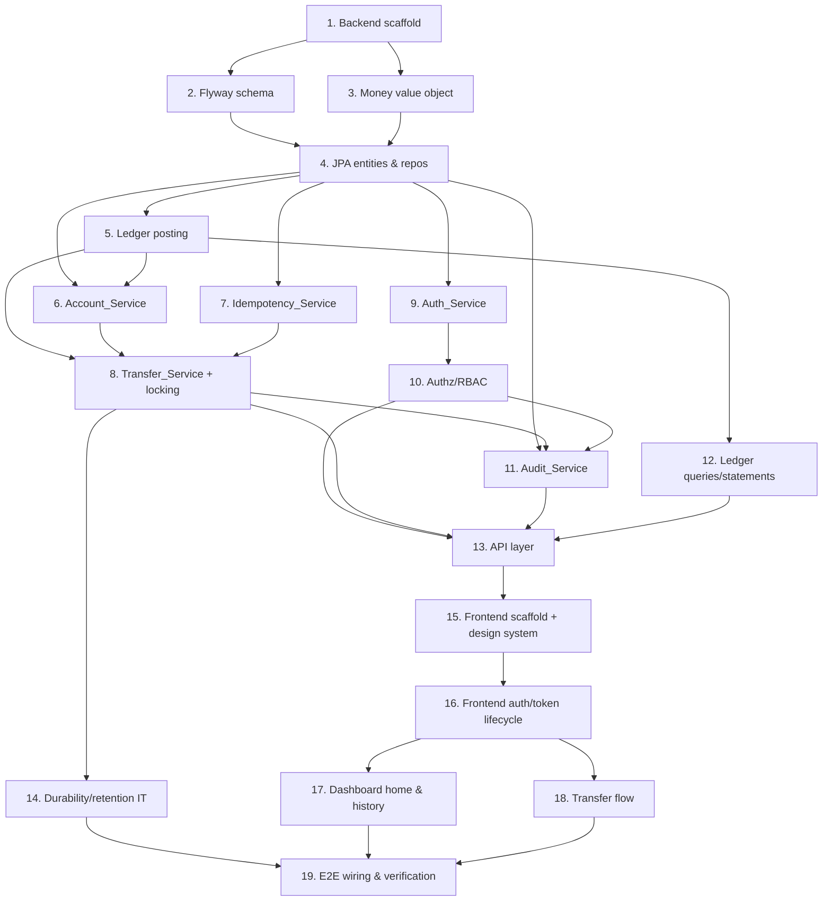

# Implementation Plan

## Overview

This plan implements Ledger-Core-Banking incrementally: scaffolding and schema first, then
the money primitives, then domain services from the inside out (ledger → accounts → transfer),
then auth/RBAC, the API layer, and finally the dashboard. Correctness-critical work
(double-entry posting and concurrency-safe transfers) is test-driven with the property-based
tests defined in the design. Each task cites the requirements and design properties it covers.

Property tags use the format: `// Feature: ledger-core-banking, Property {n}: {text}`.
Backend property tests use jqwik (min 100 iterations); frontend property tests use fast-check.

## Tasks

- [x] 1. Scaffold backend project and PostgreSQL/Flyway baseline
  - Create a Spring Boot 3.2 (Java 21) Gradle project with modules/packages for `api`, `domain`, `persistence`, `security`, `config`
  - Add dependencies: Spring Web, Spring Data JPA, Spring Security, Flyway, PostgreSQL driver, HikariCP, MapStruct, jjwt/Nimbus, Argon2 (Spring Security), jqwik, JUnit 5, Testcontainers
  - Configure `application.yml` for PostgreSQL, HikariCP, JPA (no auto-DDL; Flyway owns schema), and the configurable `lock_timeout` property (default 5s, range 1–30s)
  - Add a Testcontainers PostgreSQL base test class used by all integration tests
  - _Requirements: 9.1, 9.3, 7.7_

- [x] 2. Create Flyway schema migrations with integrity constraints
- [x] 2.1 Author the core migration (V1) for users, accounts, transactions, ledger_entries
  - `users` (id, email_normalized UNIQUE, password_hash, role, created_at); `accounts` (id, owner_id FK, currency CHAR(3), status, overdraft_limit NUMERIC(38,4) DEFAULT 0 CHECK >= 0, balance_cache, created_at); `transactions` (id, currency, reverses_txn_id self-FK, posted_at); `ledger_entries` (id, transaction_id FK, account_id FK, direction CHECK IN (DEBIT,CREDIT), amount NUMERIC(38,4) CHECK > 0, posted_at)
  - Add index `ledger_entries(account_id, posted_at, id)` for ordered queries and running balance
  - _Requirements: 4.1, 4.2, 5.7, 5.9, 10.1_
- [x] 2.2 Author the supporting migration (V2) for idempotency_keys, refresh_tokens, audit_log, login_attempts
  - `idempotency_keys` (idempotency_key PK, request_fingerprint, status CHECK IN (IN_PROGRESS,COMPLETED), transaction_id FK, created_at); `refresh_tokens` (jti PK, user_id FK, token_hash, revoked, expires_at); `audit_log` (id, actor_id, action_type, target_id, outcome, occurred_at); `login_attempts` (id, email_normalized, success, attempted_at)
  - _Requirements: 2.6, 2.7, 2.9, 8.1, 8.5, 11.1, 11.2_
- [x] 2.3 Enforce append-only at the DB role level
  - Create a dedicated application DB role and REVOKE UPDATE/DELETE on `ledger_entries` and `audit_log`
  - Add an integration test asserting UPDATE/DELETE against these tables fails
  - _Requirements: 5.7, 11.2, 11.4_

- [x] 3. Implement the Money value object and currency support
  - Implement an immutable `Money { BigDecimal amount, Currency currency }` with addition/subtraction at the currency scale and value equality (no floating point)
  - Implement ISO 4217 validation and minor-unit precision lookup; reject unsupported codes and over-precise amounts
  - Implement decimal-string serialization/deserialization for the API
  - Write property tests for money exactness, currency validation, amount validation, and serialization round-trip
    - `// ... Property 19: Monetary arithmetic is decimal-exact`
    - `// ... Property 36: Currency codes are validated`
    - `// ... Property 37: Amount validation enforces non-negativity and currency precision`
    - `// ... Property 38: Money serialization round-trip preserves value`
  - _Requirements: 5.9, 12.2, 12.3, 12.6, 12.7, 4.8_

- [x] 4. Implement JPA entities and repositories
  - Map `User`, `Account`, `Transaction`, `LedgerEntry`, `IdempotencyKey`, `RefreshToken`, `AuditLog`, `LoginAttempt` to the Flyway schema
  - Add Spring Data repositories; ledger and audit repositories expose insert + read only (no update/delete methods)
  - Add an account repository method using `@Lock(LockModeType.PESSIMISTIC_WRITE)` that emits `SELECT ... FOR UPDATE`
  - _Requirements: 4.4, 5.7, 7.1, 11.2_

- [x] 5. Implement Ledger_Service double-entry posting (test-driven)
- [x] 5.1 Implement `postTransaction` with full balance validation
  - Validate ≥1 debit and ≥1 credit, single shared currency, and Σdebits == Σcredits before any write; persist transaction + entries in one `@Transactional` boundary; reject with no persistence on any violation
  - _Requirements: 5.1, 5.2, 5.3, 5.4, 5.5, 5.6, 9.1_
- [x] 5.2 Implement `reverseTransaction`
  - Post a new balanced transaction with each entry's direction flipped, equal amounts, referencing the original transaction id; never mutate original entries
  - _Requirements: 5.8_
- [x] 5.3 Write posting and reversal property tests
  - `// ... Property 16: Posting is accepted iff well-formed, else nothing is persisted`
  - `// ... Property 17: The ledger is append-only`
  - `// ... Property 18: Reversal nets to zero and preserves the original`
  - `// ... Property 25: Money movement is atomic under failure` (inject failure after partial writes; assert full rollback)
  - _Requirements: 5.1, 5.3, 5.4, 5.5, 5.6, 5.7, 5.8, 6.6, 9.2_

- [x] 6. Implement Account_Service
  - Implement `openAccount` (ACTIVE, zero balance, immutable currency, unique id; reject unsupported currency), `viewAccount` (not-found handling), `closeAccount` (require ACTIVE + zero balance; reject non-zero and already-CLOSED), and `getAvailableBalance` derived solely from posted entries
  - Reject money movement against CLOSED accounts
  - Write property tests:
    - `// ... Property 11: New accounts satisfy opening invariants`
    - `// ... Property 12: Account currency is immutable`
    - `// ... Property 13: Available balance is derived solely from posted entries`
    - `// ... Property 14: Account closure rules`
    - `// ... Property 15: Closed accounts reject money movement`
  - _Requirements: 4.1, 4.2, 4.3, 4.4, 4.5, 4.6, 4.7, 4.8, 4.9, 4.10_

- [x] 7. Implement Idempotency_Service
  - Implement `begin(key, fingerprint)` returning BEGUN / DUPLICATE_IN_PROGRESS / REPLAY(result) / CONFLICT, using the `idempotency_keys` primary key for the single-winner guarantee; implement `complete(key, txnId)`
  - Validate key length 1–128; compute fingerprint = hash(source, dest, amount, currency); enforce ≥24h retention with a cleanup job
  - Write property tests:
    - `// ... Property 26: Idempotent replay yields one transaction`
    - `// ... Property 27: Idempotency-key conflicts are rejected`
    - `// ... Property 28: Idempotency-key format is enforced`
  - _Requirements: 8.1, 8.2, 8.3, 8.4, 8.5, 8.6_

- [x] 8. Implement Transfer_Service: the funds-transfer + row-locking algorithm (test-driven)
- [x] 8.1 Implement pre-lock validation and the deterministic lock-order function
  - Validate amount > 0, source != destination, currency match, idempotency-key format before any write
  - Implement `lockOrder = sort(distinct([sourceId, destId]) ascending)`
  - `// ... Property 24: Lock acquisition order is deterministic and ascending`
  - _Requirements: 6.2, 6.3, 6.5, 7.6, 8.5_
- [x] 8.2 Implement the locked transfer execution path
  - Open transaction at READ COMMITTED, `SET LOCAL lock_timeout`; claim idempotency key; acquire `FOR UPDATE` locks in ascending order; verify accounts exist and are ACTIVE; recompute source balance under lock; enforce overdraft check; post one balanced debit/credit transaction; complete idempotency; write audit entry; commit
  - Translate lock-wait timeout (55P03) and deadlock (40P01) to a retryable error with full rollback
  - _Requirements: 6.1, 6.4, 6.6, 6.7, 6.8, 7.1, 7.2, 7.5, 7.7, 4.7, 9.1, 9.4_
- [x] 8.3 Write transfer correctness and concurrency property tests (Testcontainers)
  - `// ... Property 20: A valid transfer posts a single balanced debit/credit and conserves value`
  - `// ... Property 21: Invalid transfers are rejected and side-effect free`
  - `// ... Property 22: Overdraft limit is never breached (single or concurrent)`
  - `// ... Property 23: Concurrent balance changes are serializable and conserve value` (execute random concurrent batches on a shared account via a thread pool; assert conservation and serial-order equivalence)
  - _Requirements: 6.1, 6.2, 6.3, 6.4, 6.5, 6.6, 6.8, 7.3, 7.4, 7.5, 9.3_
- [x] 8.4 Write row-locking and timeout integration tests
  - Instrument lock acquisition order/FIFO against real PostgreSQL; hold a lock and assert a conflicting transfer returns a retryable error with full rollback; verify timeout is configurable within 1–30s
  - _Requirements: 7.1, 7.2, 7.7_

- [x] 9. Implement Auth_Service
- [x] 9.1 Implement registration with Argon2id and policy/email validation
  - Hash with Argon2id (never store reversibly); enforce password policy (12–128, ≥1 letter, ≥1 digit) and email well-formedness; normalize email lowercase; reject duplicates case-insensitively; assign CUSTOMER role
  - Property tests:
    - `// ... Property 1: Valid registration creates exactly one CUSTOMER`
    - `// ... Property 2: Password policy is enforced`
    - `// ... Property 3: Email well-formedness is enforced and uniqueness is case-insensitive`
    - `// ... Property 4: Passwords are stored only as irreversible hashes`
  - _Requirements: 1.1, 1.2, 1.3, 1.4, 1.5, 1.6_
- [x] 9.2 Implement login, token issuance, refresh, logout, and lockout
  - Issue RS256 access JWT (15-min TTL) + opaque refresh token stored as hash (7-day TTL); enumeration-resistant generic errors with constant-time comparison and dummy hash for unknown email; refresh validity/revocation; logout invalidation; 5-failure/15-min lockout via `login_attempts`
  - Property tests:
    - `// ... Property 5: Authentication is enumeration-resistant`
    - `// ... Property 6: Token lifetimes are exact`
    - `// ... Property 7: Refresh-token validity round-trip`
    - `// ... Property 8: Login lockout after repeated failures`
  - Unit tests for malformed/expired/wrong-signature access tokens
  - _Requirements: 2.1, 2.2, 2.3, 2.4, 2.5, 2.6, 2.7, 2.8, 2.9_

- [x] 10. Implement Authz_Service and RBAC enforcement
  - Enforce single role per user; `@PreAuthorize` role gates plus ownership predicate for CUSTOMER account access; TELLER read-any + post-on-behalf; ADMIN read-all + role management; deny with no state change
  - Implement `changeUserRole` (ADMIN-only, valid target + valid role, audited with previous/new role/actor/timestamp; reject invalid role or unknown user)
  - Property tests:
    - `// ... Property 9: RBAC decisions match the role/ownership matrix and denials are side-effect free`
    - `// ... Property 10: Role changes are valid-only and audited`
  - _Requirements: 3.1, 3.2, 3.3, 3.4, 3.5, 3.6, 3.7, 3.8, 3.9, 10.5_

- [x] 11. Implement Audit_Service
  - Append-only recording of auth success/failure, account open/close, transfers, and role changes with actor, action, target, outcome, and millisecond timestamp; write audit row inside the same transaction as the action (action not successful unless audit commits); deny update/delete; ADMIN-only deterministic ordered query
  - Property tests:
    - `// ... Property 33: Sensitive actions produce complete audit entries atomically`
    - `// ... Property 34: The audit log is append-only and admin-queryable in deterministic order`
  - Unit test for the audit internal-error retrieval path
  - _Requirements: 11.1, 11.2, 11.3, 11.4, 11.5, 11.6_

- [x] 12. Implement Ledger query and statement endpoints
  - Implement `listEntries` (ordered by posted_at ASC, id ASC; inclusive date range; reject inverted range and invalid cursor) and `statement` (running balance = prefix sum); cursor pagination bounded to 1–500, default 50
  - Property tests:
    - `// ... Property 29: Ledger queries are deterministically ordered`
    - `// ... Property 30: Date-range filtering is exact`
    - `// ... Property 31: Statement running balance equals the prefix sum`
    - `// ... Property 32: Pagination is bounded and lossless`
  - Unit tests for inverted date range and invalid cursor
  - _Requirements: 10.1, 10.2, 10.3, 10.4, 10.6, 10.7_

- [x] 13. Implement the API layer: controllers, validation, and uniform error envelope
- [x] 13.1 Implement the JWT authentication filter and security configuration
  - Servlet filter extracting/verifying Bearer JWT before controllers; HTTPS-only; CORS restricted to the dashboard origin
  - _Requirements: 2.5, 3.1_
- [x] 13.2 Implement controllers for auth, accounts, transfers, ledger, users/role, audit
  - Wire endpoints per the API map; transfers read the `Idempotency-Key` header; money fields as decimal strings with explicit currency
  - _Requirements: 1.1, 2.1, 2.4, 2.6, 4.1, 4.3, 4.5, 6.1, 10.1, 10.3, 3.6, 11.3_
- [x] 13.3 Implement the global error handler and error-code catalog
  - Map domain errors to the uniform envelope with machine-readable codes; success responses carry no error fields; field-level validation detail; bean validation + custom validators for body/amount/currency
  - Property tests:
    - `// ... Property 35: Malformed requests are rejected with field-level detail and no state change`
    - `// ... Property 39: Response envelope is well-formed`
  - _Requirements: 12.1, 12.2, 12.3, 12.4, 12.5, 12.6, 12.7_

- [x] 14. Backend durability and retention integration tests
  - Commit then restart the PostgreSQL container and assert entries persist; kill a transaction before commit and assert nothing persists; verify idempotency retention window >= 24h with recent-key exclusion
  - _Requirements: 9.4, 9.5, 8.6_

- [x] 15. Scaffold the frontend and design system
  - Create the React 18 + TypeScript + Vite app with TanStack Query, React Hook Form, Zod, fast-check, and Axios
  - Implement the design-token system (type scale with tabular numerals, restrained color with WCAG AA semantic colors, 8px spacing, purposeful motion) and hand-built Button, Input, Card, Table, Toast, Modal, and Money components with keyboard accessibility
  - _Requirements: 14.9, 14.11_

- [x] 16. Implement frontend auth and token lifecycle
  - Login screen (store access + refresh tokens, transition to dashboard; generic error and stay on login on failure); Axios request interceptor attaching the access token; response interceptor performing transparent refresh + single retry, and session termination + redirect on refresh failure; logout invalidating the refresh token server-side and clearing local tokens
  - fast-check + component tests; cover token interceptor behavior
  - _Requirements: 13.1, 13.2, 13.3, 13.4, 13.5, 13.6_

- [x] 17. Implement the dashboard home and account history
  - Home lists owned accounts with currency and balance (target < 3s) with an empty state when none exist; history view shows ledger entries with running balance at 50 per page; render all money with the currency's symbol and precision; responsive layout below 768px
  - Frontend property test:
    - `// Feature: ledger-core-banking, Property 41: Money rendering uses the currency's symbol and precision`
  - Component tests for empty state and history rendering; responsive snapshot tests above/below 768px
  - _Requirements: 14.1, 14.8, 14.9, 14.10, 14.11_

- [x] 18. Implement the transfer flow
  - Transfer form generating a UUID `Idempotency-Key` per submission; disable submit while in flight and re-enable on success/failure; success confirmation with updated balances via query invalidation; insufficient-funds message leaving balances unchanged; 30-second client timeout message leaving balances unchanged
  - Frontend property test:
    - `// Feature: ledger-core-banking, Property 40: Dashboard generates a well-formed unique idempotency key per submission`
  - Component tests for submit lifecycle, insufficient-funds, and timeout messaging
  - _Requirements: 14.2, 14.3, 14.4, 14.5, 14.6, 14.7_

- [x] 19. End-to-end wiring and final verification
  - Provide docker-compose for PostgreSQL + backend + frontend; seed an ADMIN and sample accounts via a migration/dev profile
  - Run the full backend (jqwik + Testcontainers) and frontend (fast-check + RTL) suites; confirm all 41 properties and integration tests pass and the build is green
  - _Requirements: 9.1, 9.3, 7.3_

## Task Dependency Graph

```json
{
  "waves": [
    { "wave": 1, "tasks": ["1"] },
    { "wave": 2, "tasks": ["2", "3"] },
    { "wave": 3, "tasks": ["4"] },
    { "wave": 4, "tasks": ["5", "9"] },
    { "wave": 5, "tasks": ["6", "7", "10"] },
    { "wave": 6, "tasks": ["8", "12"] },
    { "wave": 7, "tasks": ["11", "14"] },
    { "wave": 8, "tasks": ["13"] },
    { "wave": 9, "tasks": ["15"] },
    { "wave": 10, "tasks": ["16"] },
    { "wave": 11, "tasks": ["17", "18"] },
    { "wave": 12, "tasks": ["19"] }
  ]
}
```



## Notes

- The backend (Tasks 1–14) is independently testable and can be completed and verified
  before the frontend (Tasks 15–18) begins; Task 13 (API layer) is the contract boundary
  between them.
- Correctness-critical tasks are 5 (double-entry posting) and 8 (funds transfer + row
  locking). These are test-driven and their concurrency properties (22, 23) and locking
  integration tests (8.4) run against real PostgreSQL via Testcontainers, not mocks.
- All 41 design properties are allocated: Properties 1–8 (Task 9), 9–10 (Task 10),
  11–15 (Task 6), 16–18 & 25 (Task 5), 19 & 36–38 (Task 3), 20–24 (Task 8), 26–28 (Task 7),
  29–32 (Task 12), 33–34 (Task 11), 35 & 39 (Task 13), 40 (Task 18), 41 (Task 17).
- Append-only guarantees are enforced at two layers: the DB role (Task 2.3, no UPDATE/DELETE
  grants) and the application (repositories expose no mutation methods).
- Tasks cover only code, tests, migrations, and local docker-compose wiring. Production
  deployment, secrets management, and key rotation are out of scope for this plan.
